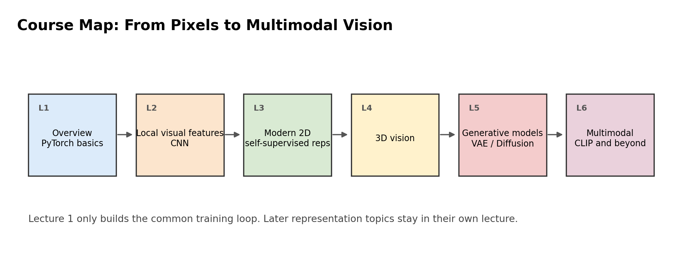
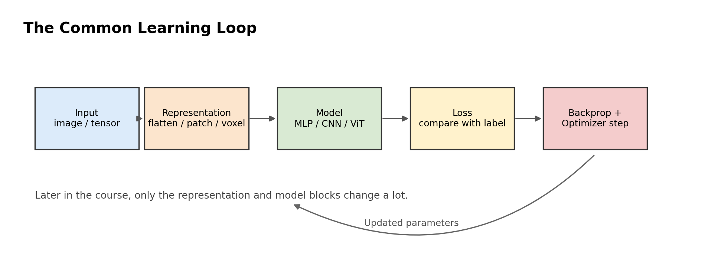
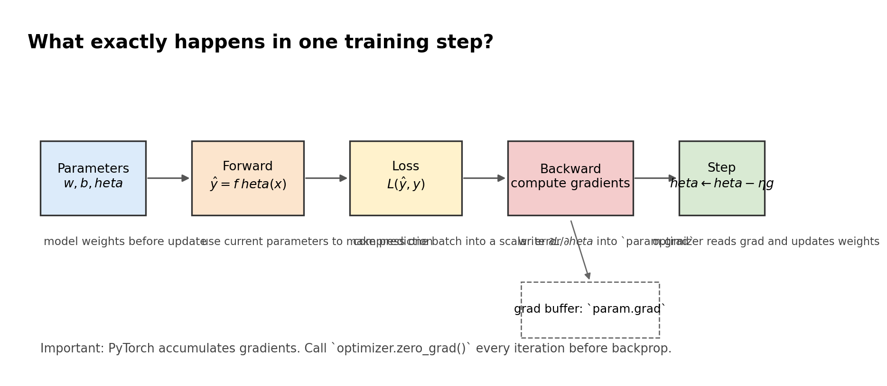
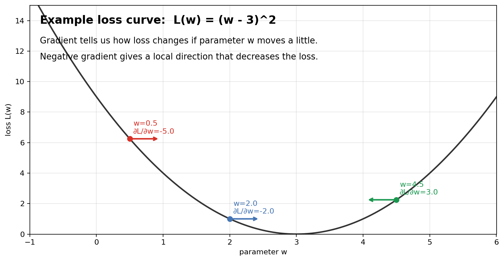
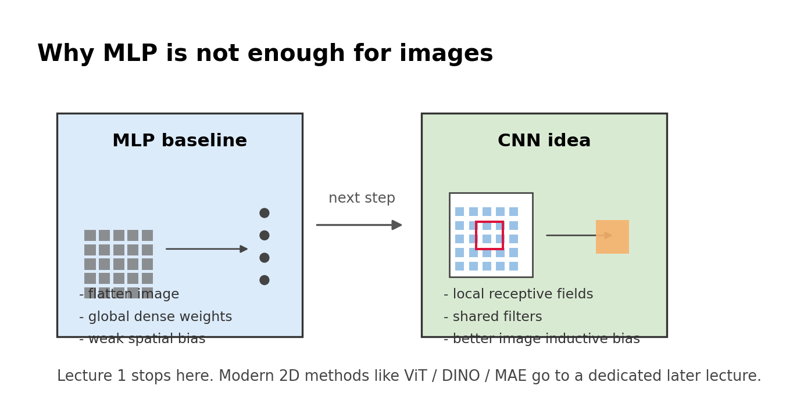

# 第一讲：视觉学习总览与 PyTorch 基础
## 可粘贴大纲版讲稿

使用说明：
- 课程总时长按 `3 小时` 设计，含一次 `10 分钟` 课间休息
- 每个 `Slide` 对应一页幻灯片
- `页面文案` 适合直接粘贴到幻灯片
- `讲者提示` 建议放在备注区，不必全部上屏
- `对应授课 notebook` 默认指向本次新整理的讲课版 notebook：
  [第一讲_视觉学习总览与PyTorch基础_讲解版.ipynb](./第一讲_视觉学习总览与PyTorch基础_讲解版.ipynb)

---

## 总体节奏安排

| 时间 | 模块 | 目标 |
| --- | --- | --- |
| 0-15 分钟 | 开场与课程地图 | 建立整门课的结构感 |
| 15-40 分钟 | 从数据看视觉任务 | 让学生知道图像、标签、类别、评估分别是什么 |
| 40-85 分钟 | 神经网络最小闭环 | 讲清前向传播、损失、梯度、学习率 |
| 85-95 分钟 | 休息 | 建议停下来，不要硬讲满 |
| 95-135 分钟 | PyTorch 基础 | 讲清 Tensor、autograd、Module、optimizer |
| 135-170 分钟 | FashionMNIST 完整例子 | 把训练流程落到真实视觉任务 |
| 170-180 分钟 | 总结与下节预告 | 自然过渡到 CNN |

---

## Slide 1 封面（2 分钟）

页面标题：第一讲：视觉学习总览与 PyTorch 基础

副标题：计算机视觉计算课程

页面文案：
- 从像素到语义：计算机如何“看懂”图像
- 用一节课搭起后续整门课的主线
- 关键词：数据、模型、损失、梯度、优化、评估

讲者提示：
- 开场不要直接讲公式。
- 先告诉学生：这门课后面会有 CNN、现代视觉表征、3D、生成、多模态等专题，但第一讲先把共同骨架搭起来。

对应授课 notebook：
- 标题页

---

## Slide 2 这门课后面会讲什么（3 分钟）

页面标题：课程地图

页面文案：
- 第一讲：视觉学习总览与 PyTorch 基础
- 第二讲：pixel 表征与 CNN
- 第三讲：现代 2D 表征专题
- 第四讲：3D 视觉
- 第五讲：VAE 与 Diffusion
- 第六讲：多模态与 CLIP

建议插图：
- 本地文件：
  

讲者提示：
- 强调第一讲不是孤立的导论，而是后面每一讲的“共用接口说明书”。

对应授课 notebook：
- `课程地图`

---

## Slide 3 本节课的学习目标（3 分钟）

页面标题：这节课学完要带走什么

页面文案：
- 理解视觉任务里“输入、标签、模型、损失、优化”的关系
- 理解训练闭环：预测 -> 计算损失 -> 反向传播 -> 更新参数
- 认识 PyTorch 的基本角色分工
- 能读懂一个最基本的图像分类训练脚本
- 知道为什么下一讲要讲 CNN

讲者提示：
- 这一页建议明确说：本节课不是为了追求最高精度，而是为了把训练逻辑彻底讲通。

对应授课 notebook：
- `本节课学习目标`

---

## Slide 4 为什么第一讲要先讲共同主线（4 分钟）

页面标题：后面模型很多，但训练逻辑很少变

页面文案：
- 后面会遇到 MLP、CNN、现代 Transformer 系视觉模型、3D 表征、Diffusion、CLIP
- 这些模型的结构差异很大
- 但训练时仍然离不开共同闭环
- 真正要先学会的是：如何把问题写成一个可训练的计算图

讲者提示：
- 可以先问学生：后面模型差别很大，但训练时都离不开什么？

对应授课 notebook：
- `The Common Learning Loop` 前的引导页

---

## Slide 5 计算机视觉到底在做什么（5 分钟）

页面标题：视觉任务的统一视角

页面文案：
- 输入通常是图像、视频、深度图、点云
- 输出可能是类别、框、mask、关键点、深度、3D 形状、文本
- 视觉的核心是：从像素中提取有用表征，再完成任务

讲者提示：
- 建议这页不要铺太多任务细节。
- 重点是让学生知道：不同视觉任务只是“输出形式不同”。

对应授课 notebook：
- `Part 1. 先看数据：视觉任务到底在处理什么？`

---

## Slide 6 先从一个最简单的数据集开始（5 分钟）

页面标题：为什么先看 FashionMNIST

页面文案：
- 图像足够简单，课堂上易于观察
- 是标准分类任务，适合讲训练闭环
- 后面换成更复杂图像时，流程不变

讲者提示：
- 这一页很适合作为“从抽象到具体”的过渡。

对应授课 notebook：
- `FashionMNIST` 加载代码之前
- 原书来源：
  [Preparing_our_data.ipynb](/Users/mlyuan413/homework/004-苛捐杂税/003-计算机视觉计算课程/Modern-Computer-Vision-with-PyTorch-2E/Chapter03/Preparing_our_data.ipynb)

---

## Slide 7 数据长什么样（8 分钟）

页面标题：图像、标签和类别

页面文案：
- 单张图像大小：`28 x 28`
- 灰度图像，像素值是数值张量
- 标签是 10 个类别中的一个
- 一个分类数据集至少包含：图像、标签、类别名

讲者提示：
- 这页建议直接切到 notebook 演示：
  - 数据集大小
  - 类别名
  - 单张图像尺寸

对应授课 notebook：
- `train_raw / val_raw` 加载单元
- `训练集大小、验证集大小、类别名` 输出单元

---

## Slide 8 给学生看样本，不要只说 shape（8 分钟）

页面标题：先让学生“看见”数据

页面文案：
- 不同类别之间有哪些直观差异
- 哪些类别很容易混淆
- 视觉模型为什么需要学到更稳定的表征

讲者提示：
- 这页建议现场展示随机采样图。
- 可以现场提问：
  - 凉鞋和运动鞋容易混吗？
  - 衬衫和套头衫为什么会混？

对应授课 notebook：
- `FashionMNIST examples` 图像网格单元

---

## Slide 9 从视觉任务切回学习问题（5 分钟）

页面标题：现在把问题写成机器学习语言

页面文案：
- 输入：像素张量
- 输出：类别标签
- 模型：一个参数化函数
- 目标：让预测更接近真实标签
- 方法：优化参数

讲者提示：
- 这是从“看图像”转向“讲模型”的关键转场页。

对应授课 notebook：
- `Part 2. 从一个极简模型理解训练闭环`

---

## Slide 10 最小神经网络闭环（6 分钟）

页面标题：训练到底在做什么

页面文案：
- 用当前参数做一次预测
- 计算预测和真实值之间的误差
- 计算误差对参数的梯度
- 根据梯度更新参数
- 重复很多次，直到损失下降

建议插图：
- 本地文件：
  

讲者提示：
- 这一页是全课最关键的一页。
- 后面每次遇到新模型，都回到这张图来解释。
- 但这一页还只是“口号版”，下一页必须把每一步在代码里到底做了什么讲透。

对应授课 notebook：
- `The Common Learning Loop`

---

## Slide 10A 这四步在 PyTorch 里其实会写成五行（8 分钟）

页面标题：把口号变成真正会执行的代码

页面文案：
```python
pred = model(x)
loss = loss_fn(pred, y)
optimizer.zero_grad()
loss.backward()
optimizer.step()
```

页面文案补充：
- `pred`：只是前向计算，参数还没改
- `loss`：把一个 batch 的误差压缩成标量
- `zero_grad`：清理旧梯度
- `backward`：把梯度写进 `param.grad`
- `step`：优化器真正修改参数

讲者提示：
- 一定要强调：`backward()` 不是更新参数，`step()` 才是。
- 很多学生第一次学 PyTorch 时，会把“算梯度”和“改参数”混成一件事。

对应授课 notebook：
- `先把“训练”写成真正会执行的五行`

---

## Slide 10B 一次训练 step 里到底发生了什么（10 分钟）

页面标题：把单步训练拆开看

页面文案：
- 先固定一个最小例子：`y_hat = wx + b`
- 打印当前参数
- 打印预测值和损失
- `backward()` 后查看 `weight.grad` / `bias.grad`
- `step()` 后再看参数和预测是否变好

建议插图：
- 本地文件：
  

讲者提示：
- 这一页最好直接切 notebook 现场跑。
- 用“单个样本 + 单层线性模型”是为了让学生第一次真正看见：
  - loss 是怎么算出来的
  - grad 被存到了哪里
  - 参数是哪一步才发生变化

对应授课 notebook：
- `用一个只含单个样本的例子，把一次训练彻底拆开`
- `单步训练拆解` 代码单元

---

## Slide 11 前向传播是什么意思（8 分钟）

页面标题：前向传播 = 用当前参数算一次输出

页面文案：
- 输入经过一层层变换变成预测值
- 前向传播本质上是函数计算
- 如果参数还不好，预测自然会差
- 所以需要损失函数来衡量“差多少”
- 在这一步里，参数是“被读取”，不是“被更新”

讲者提示：
- 可以用最简单的线性模型 `y_hat = wx + b` 讲。
- 不建议第一讲就把学生带入复杂矩阵链式推导。
- 建议反复强调：forward 只是算输出，别让学生误以为 model(x) 会自动学习。

对应授课 notebook：
- `前向传播和学习率`
- 原书来源：
  [Feed_forward_propagation.ipynb](/Users/mlyuan413/homework/004-苛捐杂税/003-计算机视觉计算课程/Modern-Computer-Vision-with-PyTorch-2E/Chapter01/Feed_forward_propagation.ipynb)

---

## Slide 12 损失函数在干什么（6 分钟）

页面标题：损失函数是训练的方向盘

页面文案：
- 损失越大，说明当前预测越差
- 损失越小，说明当前预测更接近目标
- 回归常见 MSE
- 分类常见 CrossEntropyLoss
- loss 通常要被压成一个标量，方便后面统一求梯度

讲者提示：
- 第一讲只要让学生知道：损失是“模型当前有多差”的度量。
- 不用在这节课深讲交叉熵推导。
- 但要讲清楚为什么后面总是看到一个标量 loss：因为 backward 需要围绕一个明确目标反传。

对应授课 notebook：
- `前向传播和学习率`

---

## Slide 13 学习率为什么重要（10 分钟）

页面标题：更新方向对了，步子也要合适

页面文案：
- 学习率太小：会学，但很慢
- 学习率合适：下降快而稳定
- 学习率太大：容易震荡甚至发散

讲者提示：
- 强烈建议现场跑学习率曲线图。
- 这页学生通常会有直觉收获。

对应授课 notebook：
- `run_gradient_descent` 曲线单元
- 原书来源：
  [Learning_rate.ipynb](/Users/mlyuan413/homework/004-苛捐杂税/003-计算机视觉计算课程/Modern-Computer-Vision-with-PyTorch-2E/Chapter01/Learning_rate.ipynb)

---

## Slide 14 梯度的直观解释（8 分钟）

页面标题：梯度告诉我们参数应该往哪边改

页面文案：
- 对单个参数 `w` 来说，梯度 `∂L/∂w` 表示：`w` 轻微变化时，loss 会变化多快
- 正梯度：参数再增大，loss 会变大，所以更新时通常要把参数往小调
- 负梯度：参数再增大，loss 会变小，所以更新时通常要把参数往大调
- 绝对值大：loss 对这个参数很敏感
- 绝对值小：当前位置比较平坦
- 在 PyTorch 里，梯度默认被存到每个参数的 `param.grad`

讲者提示：
- 建议直接配一张一维 loss 曲线来讲，不要只用语言解释。
- 不必把整套链式法则细推一遍，但一定要把“正负号”和“大小”讲清楚。
- 最关键的是让学生知道：`loss.backward()` 的产物不是新参数，而是 `.grad`。

对应授课 notebook：
- `梯度到底是什么？`
- 原书参考：
  [Chain_rule.ipynb](/Users/mlyuan413/homework/004-苛捐杂税/003-计算机视觉计算课程/Modern-Computer-Vision-with-PyTorch-2E/Chapter01/Chain_rule.ipynb)

---

## Slide 14A 梯度到底有什么用（8 分钟）

页面标题：梯度把“模型不好”翻译成“参数怎么改”

页面文案：
- loss 只告诉我们：模型现在好不好
- gradient 进一步告诉我们：每个参数应该往哪边调
- optimizer 正是依赖 gradient 才能更新参数
- 没有 gradient，训练就只能靠随机试错，效率极低

建议插图：
- 本地文件：
  

讲者提示：
- 这页建议明确讲出一句话：
  - “loss 是评分器，gradient 是导航仪，optimizer 是执行者。”
- 让学生建立三者分工：
  - `loss` 负责衡量当前有多差
  - `gradient` 负责告诉我们该怎么改
  - `optimizer` 负责真正去改参数

对应授课 notebook：
- `gradient_on_loss_curve` 图示页
- `用一个一维损失函数，直接看梯度的正负号和大小`

---

## Slide 14B 为什么要沿负梯度方向走（6 分钟）

页面标题：负梯度方向 = 局部下降最快方向

页面文案：
- 梯度向量指向 loss 上升最快的方向
- 所以负梯度方向指向局部下降最快的方向
- 这就是为什么更新公式常写成：

```python
param = param - lr * grad
```

页面文案补充：
- `grad > 0`，减掉它，参数会变小
- `grad < 0`，减掉它，参数会变大

讲者提示：
- 这页不要抽象讲“最速下降”四个字就结束。
- 直接把正负号代入公式讲，学生更容易吃透。

对应授课 notebook：
- `这段输出要怎么讲？`

---

## Slide 15 为什么要用框架（6 分钟）

页面标题：手推梯度能帮助理解，但不能扩展

页面文案：
- 浅层小网络可以手推
- 深层网络几乎不可能手工维护所有梯度
- 所以需要自动求导框架
- PyTorch 的价值：把计算图和梯度传播工程化
- 训练时还会帮我们管理参数对象、梯度缓存和优化器状态

讲者提示：
- 这一页是从 Chapter01 自然过渡到 Chapter02 的关键。
- 如果学生已经开始混淆 `grad` 和 `step`，就在这里收束一遍：
  - autograd 负责算梯度
  - optimizer 负责用梯度更新参数

对应授课 notebook：
- `Part 3. 为什么 PyTorch 重要：自动求导`

---

## Slide 16 休息前的小结（5 分钟）

页面标题：到这里为止，学生应该已经知道

页面文案：
- 图像任务可以写成机器学习问题
- 神经网络训练的最小闭环是什么
- 损失、梯度、学习率各自扮演什么角色
- 后半节课要解决的是：这些东西在 PyTorch 里怎么落地

讲者提示：
- 建议这里停下来休息 10 分钟。

对应授课 notebook：
- 无需切 notebook

---

## Slide 17 课间休息（10 分钟）

页面标题：Break

页面文案：
- 休息 10 分钟
- 休息后进入 PyTorch 实战部分

---

## Slide 18 PyTorch 里最重要的四个角色（6 分钟）

页面标题：PyTorch 在帮我们组织什么

页面文案：
- `Tensor`：保存数据与参数
- `autograd`：自动算梯度
- `nn.Module`：定义模型结构
- `optimizer`：根据梯度更新参数

讲者提示：
- 不要把这一页讲成 API 背诵。
- 要强调“角色分工”。

对应授课 notebook：
- `import` 单元
- `Part 4. 用 PyTorch 搭一个最小神经网络`

---

## Slide 19 自动求导演示（8 分钟）

页面标题：`requires_grad` 和 `backward()` 在做什么

页面文案：
- `Tensor` 可以记录梯度
- `backward()` 会从标量损失往回传播
- 传播后，每个参数的 `.grad` 就拿到了更新方向

讲者提示：
- 建议先跑平方和的简单例子，再跑一个小型两层网络例子。

对应授课 notebook：
- `A.pow(2).sum()` 自动求导单元
- `线性层 + 激活 + 损失` 梯度单元
- 原书来源：
  [Auto_gradient_of_tensors.ipynb](/Users/mlyuan413/homework/004-苛捐杂税/003-计算机视觉计算课程/Modern-Computer-Vision-with-PyTorch-2E/Chapter02/Auto_gradient_of_tensors.ipynb)

---

## Slide 20 一个最小神经网络（8 分钟）

页面标题：`nn.Module` / `nn.Sequential` 让模型定义变简单

页面文案：
- 模型本质上还是一个函数
- 只是现在用模块化方式来写
- 层、激活函数、输出头可以直接组合

讲者提示：
- 建议用 toy dataset 先讲，不要一上来就上图像。
- 因为此时学生需要先读懂训练代码，而不是被图像任务分散注意力。

对应授课 notebook：
- `model_toy = nn.Sequential(...)`
- 原书来源：
  [Building_a_neural_network_using_PyTorch_on_a_toy_dataset.ipynb](/Users/mlyuan413/homework/004-苛捐杂税/003-计算机视觉计算课程/Modern-Computer-Vision-with-PyTorch-2E/Chapter02/Building_a_neural_network_using_PyTorch_on_a_toy_dataset.ipynb)

---

## Slide 21 五行训练模板（10 分钟）

页面标题：以后所有课都会反复出现的五行

页面文案：
```python
optimizer.zero_grad()
pred = model(X)
loss = loss_fn(pred, Y)
loss.backward()
optimizer.step()
```

讲者提示：
- 这一页建议慢下来，一行一行解释。
- 尤其要解释：
  - `optimizer.zero_grad()` 是清空旧梯度
  - `pred` 是当前参数下的输出
  - `loss.backward()` 是把误差信号传回去
  - `optimizer.step()` 才是真正更新参数

对应授课 notebook：
- `Toy network training loss` 单元之前和之后

---

## Slide 22 为什么还需要 DataLoader（6 分钟）

页面标题：现实数据不会像 toy 例子那样一次性塞进模型

页面文案：
- 数据量变大后，需要按 batch 读入
- 训练时常常需要 shuffle
- 图像任务通常还需要预处理
- 所以需要 `Dataset` 和 `DataLoader`

讲者提示：
- 这页是从 toy 数据切回真实视觉任务的桥。

对应授课 notebook：
- `Part 5. 从 toy 问题走到真实视觉任务：FashionMNIST 分类`

---

## Slide 23 从 toy 到视觉分类（5 分钟）

页面标题：为什么图像分类代码更长

页面文案：
- 因为多了数据组织与预处理
- 因为输出变成多类别分类
- 因为需要训练集和验证集
- 但训练闭环本身并没有变

讲者提示：
- 这一页要帮助学生建立“变与不变”的意识。

对应授课 notebook：
- `transform / train_subset / val_subset` 单元之前

---

## Slide 24 DataLoader 和 batch shape（8 分钟）

页面标题：真实视觉训练时，一个 batch 长什么样

页面文案：
- 输入形状通常是 `[batch, channel, height, width]`
- 分类标签通常是 `[batch]`
- `ToTensor()` 之后，单张 FashionMNIST 图像会从 `28 x 28` 变成 `1 x 28 x 28`
- 像素值通常会被缩放到 `[0, 1]`
- batch 是效率和稳定性之间的折中

讲者提示：
- 建议现场打印一个 batch 的 shape。
- 让学生把这一步和前面的“单张 28x28 图像”联系起来。
- 不要只报 shape，要顺手讲清楚：
  - 为什么多了 channel 维
  - 为什么像素值范围发生了变化
  - 为什么标签是类别索引而不是 one-hot

对应授课 notebook：
- `单个样本的图像张量 shape`
- `一个 batch 的图像 shape`
- 原书参考：
  [Steps_to_build_a_neural_network_on_FashionMNIST.ipynb](/Users/mlyuan413/homework/004-苛捐杂税/003-计算机视觉计算课程/Modern-Computer-Vision-with-PyTorch-2E/Chapter03/Steps_to_build_a_neural_network_on_FashionMNIST.ipynb)

---

## Slide 24A 从图像张量到 MLP 输入（6 分钟）

页面标题：模型输入在网络里怎么变化

页面文案：
- 原始 batch：`[B, 1, 28, 28]`
- `Flatten` 之后：`[B, 784]`
- 隐藏层表示：`[B, hidden_dim]`
- 最终输出 logits：`[B, 10]`

讲者提示：
- 这一页要讲“为什么 MLP 需要 flatten”。
- 同时埋下第二讲的伏笔：
  - 能这样做，不代表这样做最合理
  - 因为空间结构在 flatten 后被打散了

对应授课 notebook：
- `FlatFashionMNIST` 模型定义单元
- `原始 batch 输入 shape / Flatten 之后 shape / logits shape`

---

## Slide 25 分类模型的输出为什么是 10 维（8 分钟）

页面标题：logits、类别数和分类损失

页面文案：
- 10 个类别，对应 10 维输出
- 每一维是该类别的打分
- 这些原始打分叫 **logits**
- logits 不是概率，但可以通过 softmax 转成概率解释
- 训练时不直接比 one-hot，而是用交叉熵损失
- 预测时取最大打分对应的类别

讲者提示：
- 这一页第一次讲 `CrossEntropyLoss` 的作用。
- 不建议深入软最大值公式推导，第一讲只讲概念。
- 最好现场展示一个样本的 logits 和 top-3 概率，学生会更容易理解。

对应授课 notebook：
- `FlatFashionMNIST` 模型定义单元
- `第一个样本的 logits 前 5 维`
- `第一个样本 top-3 预测`

---

## Slide 25A `CrossEntropyLoss` 到底在做什么（8 分钟）

页面标题：分类损失不是只看“猜对没猜对”

页面文案：
- 输入：logits，形状 `[B, C]`
- 标签：类别索引，形状 `[B]`
- 它会推动模型提高真实类别对应的分数
- 真实类别分数越低，loss 越大
- 真实类别分数越高，loss 越小

讲者提示：
- 建议直接讲一句：
  - “`CrossEntropyLoss` 关心的是：真实类别的概率够不够高。”  
- 一定提醒学生：
  - 在 PyTorch 里，不需要先手动 `softmax` 再喂给 `CrossEntropyLoss`

对应授课 notebook：
- `CrossEntropyLoss 为什么适合分类` 说明单元
- `CrossEntropyLoss 输出 / 手动验证 -log softmax(...)`

---

## Slide 26 训练与验证为什么都要看（8 分钟）

页面标题：只看训练集是不够的

页面文案：
- 训练集告诉我们模型是否学到了
- 验证集告诉我们模型是否能泛化
- 训练损失下降，不等于泛化就一定更好
- 训练阶段会更新参数，验证阶段不会

讲者提示：
- 这页可以顺便埋下后面正则化、dropout、batch norm 的伏笔。
- 一定明确区分：
  - `train_one_epoch`：前向、loss、backward、step
  - `evaluate`：前向、loss、accuracy，但不更新参数

对应授课 notebook：
- `train_one_epoch / evaluate` 定义单元

---

## Slide 27 现场训练一个最小图像分类器（10 分钟）

页面标题：把前面所有概念真正跑起来

页面文案：
- 数据：FashionMNIST 子集
- 模型：Flatten + MLP
- 损失：CrossEntropyLoss
- 优化器：Adam
- 指标：loss 与 accuracy

讲者提示：
- 现场训练只跑 2 个 epoch 就够。
- 重点是让学生看懂训练流程，而不是为了刷高精度。

对应授课 notebook：
- `for epoch in range(2)` 训练单元

---

## Slide 28 看曲线，理解模型到底学到了没有（8 分钟）

页面标题：loss 和 accuracy 曲线怎么看

页面文案：
- 训练 loss 下降：说明参数在变得更合适
- 验证 accuracy 上升：说明模型开始具备泛化能力
- 如果两者走势不一致，要开始怀疑过拟合或训练设置问题

讲者提示：
- 这页最好配现场输出曲线。

对应授课 notebook：
- `Loss / Accuracy` 曲线单元
- 原书参考：
  [Scaling_the_dataset.ipynb](/Users/mlyuan413/homework/004-苛捐杂税/003-计算机视觉计算课程/Modern-Computer-Vision-with-PyTorch-2E/Chapter03/Scaling_the_dataset.ipynb)

---

## Slide 29 看预测结果，而不是只看数字（6 分钟）

页面标题：模型到底错在哪

页面文案：
- 有些类别更容易混淆
- 错误样本往往暴露表征不足
- 视觉模型分析不能只停留在平均精度

讲者提示：
- 这页建议现场展示预测图。
- 让学生观察：哪些错误是“人也会犹豫”的，哪些是模型的明显短板。

对应授课 notebook：
- `验证集预测结果` 单元

---

## Slide 29A 再往前一步：用 confusion matrix 看整体错误模式（6 分钟）

页面标题：不只看单个样本，还要看系统性混淆

页面文案：
- 对角线高：说明该类识别较稳定
- 非对角线高：说明某两类经常混淆
- 这能帮助我们判断：问题是数据难、模型弱，还是表征不足

讲者提示：
- 这是把“看几个样本”提升到“看整体错误结构”的一步。
- 很适合为后面讲更强表征模型做铺垫。

对应授课 notebook：
- `Validation Confusion Matrix`

---

## Slide 30 为什么这一讲故意先用 MLP（5 分钟）

页面标题：先用不完美的模型，是为了看清流程

页面文案：
- MLP 对图像并不是最优结构
- 但它足够简单，能把训练逻辑讲清楚
- 当学生理解了共用闭环，再讲 CNN 才会更顺

讲者提示：
- 这是连接第一讲和第二讲的教学设计说明。

对应授课 notebook：
- `Part 6. 为什么下一讲要讲 CNN？`

---

## Slide 31 下一讲为什么需要 CNN（8 分钟）

页面标题：Flatten 图像会丢掉什么

页面文案：
- 图像的局部邻域关系
- 边缘和纹理的局部模式
- 空间平移时的共享结构
- 参数效率

建议插图：
- 本地文件：
  

讲者提示：
- 不必深讲卷积公式。
- 只要让学生明确：CNN 不是“更复杂的 MLP”，而是“更适合图像的结构归纳偏置”。
- 现代 2D 表征如 ViT / DINO / MAE 如果已经有专题课，这里就不要展开。

对应授课 notebook：
- `Why MLP is not enough for images`
- 原书参考：
  [Impact_of_building_a_deeper_neural_network.ipynb](/Users/mlyuan413/homework/004-苛捐杂税/003-计算机视觉计算课程/Modern-Computer-Vision-with-PyTorch-2E/Chapter03/Impact_of_building_a_deeper_neural_network.ipynb)

---

## Slide 32 全课总结（6 分钟）

页面标题：第一讲真正要记住的五句话

页面文案：
- 图像本质上是张量，视觉任务是从张量到语义的映射
- 训练闭环是：预测 -> 计算损失 -> 反向传播 -> 更新参数
- PyTorch 帮我们自动处理梯度和参数更新
- 一个最基本的视觉分类系统已经包含了数据、模型、损失、优化器和评估
- MLP 帮我们理解流程，CNN 将帮助我们更好地理解图像

讲者提示：
- 最后一页不要再扩内容。
- 用来收束主线，并给第二讲留下一个清晰的入口。

对应授课 notebook：
- `小结`

---

## 课后建议

如果你打算把这节课做得更完整，可以在课后布置两类作业：

- 代码作业：
  - 把 notebook 中的 MLP 隐藏层宽度从 `256` 改成 `64/512`
  - 把优化器从 `Adam` 改成 `SGD`
  - 把训练 epoch 从 `2` 改成 `5`
  - 观察 loss / accuracy 曲线变化

- 思考题：
  - 为什么图像分类不能只看训练集精度？
  - 为什么“直接 flatten 图像”会让模型吃亏？
  - CNN 相比 MLP，到底利用了什么图像结构？

---

## 本讲使用文件

- 讲稿大纲：
  [第一讲_视觉学习总览与PyTorch基础_大纲.md](./第一讲_视觉学习总览与PyTorch基础_大纲.md)
- 授课 notebook：
  [第一讲_视觉学习总览与PyTorch基础_讲解版.ipynb](./第一讲_视觉学习总览与PyTorch基础_讲解版.ipynb)
- 插图目录：
  [images/lesson1_intro](./images/lesson1_intro)
